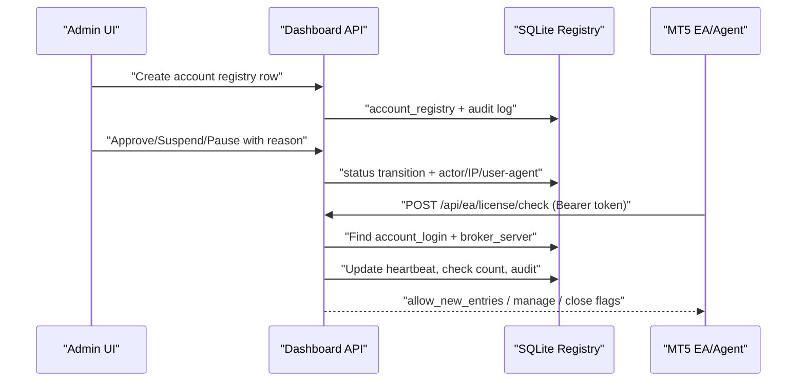

# Account Approval and Suspension License Gate

## Requirements

The web dashboard is now the source of truth for MT5 account approval. This phase is a license/account gate only.

- No trade execution from the web.
- No MT5 trade password or investor password storage.
- No hardcoded token or secret in the repository.
- Production EA files stay untouched. EA integration must be tested in a lab/prototype first.
- Admin can register MT5 accounts, approve/suspend/pause/liquidate/review them, and inspect audit history.
- EA/Agent can call `POST /api/ea/license/check` before opening new entries.

## Status Model

| Status | New entries | Manage existing | Close existing | Intended use |
|---|---:|---:|---:|---|
| `APPROVED` | yes | yes | yes | Normal trading |
| `PAUSED_NEW_ENTRIES` | no | yes | yes | Stop adding risk, keep basket management |
| `SUSPENDED` | no | yes | yes | Account is blocked from new trades |
| `LIQUIDATE_ONLY` | no | no | yes | Reduce/close exposure only |
| `EXPIRED` | no | yes | yes | Approval expired |
| `REVIEW` | no | yes | yes | Not approved or mismatch needs admin review |

## Architecture



## Database Schema

`init_db()` creates these tables:

- `account_registry`: MT5 account approval record and last EA heartbeat.
- `account_audit_log`: immutable audit events for status changes, imports, updates, and license checks.
- `ea_agent_tokens`: hashed per-agent bearer tokens. The default token can be seeded from `EA_LICENSE_API_TOKEN`.

Important columns:

- `account_login`, `broker_name`, `broker_server`, `account_type`, `symbol`
- `ib_group`, `referral_tag`, `owner_name`, `note`
- `allowed_eas`, `allowed_version`, `allowed_build_hash`, `allowed_preset`, `risk_profile`
- `status`, `reason`, `approved_by`, `approved_at`, `suspended_by`, `suspended_at`, `expiry_date`
- `last_license_check_at`, `last_ea_heartbeat_at`, `last_ea_name`, `last_ea_version`, `last_symbol`, `last_machine_id_hash`
- `license_check_count`, `license_reject_count`

## Admin API

- `GET /api/admin/accounts`
- `POST /api/admin/accounts`
- `PUT /api/admin/accounts/{account_id}`
- `POST /api/admin/accounts/{account_id}/status`
- `GET /api/admin/accounts/{account_id}/audit`
- `GET /api/admin/audit-log`
- `POST /api/admin/accounts/import-csv`

All admin endpoints require the existing admin session cookie.

## EA License Check API

`POST /api/ea/license/check`

Headers:

```http
Authorization: Bearer <per-agent-token>
```

Request:

```json
{
  "account_login": "97075178",
  "broker_server": "InterStellarFinancial-Server",
  "symbol": "XAUUSD.c",
  "ea_name": "SteadyFlow",
  "ea_version": "V1.4 X10 TH",
  "magic": 56789,
  "build_hash": "...",
  "machine_id": "...",
  "timestamp": "..."
}
```

Approved response:

```json
{
  "status": "APPROVED",
  "allow_new_entries": true,
  "allow_manage_existing": true,
  "allow_close_existing": true,
  "message": "approved",
  "check_interval_seconds": 60
}
```

Suspended response:

```json
{
  "status": "SUSPENDED",
  "allow_new_entries": false,
  "allow_manage_existing": true,
  "allow_close_existing": true,
  "message": "account suspended by admin: reason...",
  "check_interval_seconds": 30
}
```

## Security Checklist

- Tokens are accepted via `Authorization: Bearer` or `X-EA-Token`.
- Tokens are hashed with SHA-256 before storage/lookup.
- No token value is returned to UI or written to audit metadata.
- Basic per-IP/token rate limiting is applied to license checks.
- Status transitions require an admin session and a reason.
- Audit rows include actor, role, IP, user agent, old status, new status, reason, and metadata.
- Demo users cannot see registry, audit, Reporter, System Health, or admin actions.
- HMAC request signing is documented as a later hardening step if replay protection is required beyond bearer tokens.

## CSV Import Guide

Required columns:

```csv
account_login,broker_server
```

Optional columns:

```csv
broker_name,status,allowed_eas,symbol,account_type,ib_group,referral_tag,owner_name,note,allowed_version,allowed_build_hash,allowed_preset,risk_profile,expiry_date,reason
```

`allowed_eas` may be a comma list or JSON list.

## EA Behavior Design

- `OnInit`: call license check once. If unavailable, start in paused-new-entries mode unless a valid last-known approval exists.
- `OnTimer`: repeat every `check_interval_seconds`.
- `APPROVED`: normal trading.
- `PAUSED_NEW_ENTRIES`: block new entries, keep existing basket management.
- `SUSPENDED`: block new entries, keep existing basket management and close paths.
- `LIQUIDATE_ONLY`: block new entries and management actions except close/reduce exposure.
- `EXPIRED` or `REVIEW`: block new entries.
- API outage: allow last-known-approved only until TTL, for example 10-30 minutes. After TTL, pause new entries.
- Never spam orders when AutoTrading is disabled or license blocks new entries.

## Current Implementation State

Implemented:

- Additive SQLite migration/schema.
- Admin Account Registry UI.
- Admin Audit Log UI.
- License check API with bearer token, rate limit, status decisions, heartbeat fields, and audit events.
- Dashboard account enrichment with `approval_status`.
- CSV import report.
- Lab MQL5 module documentation/prototype.

Not live yet:

- Production EA integration.
- HMAC signature verification.
- Dedicated token creation UI.
- Direct trading controls from web. This is intentionally excluded.
