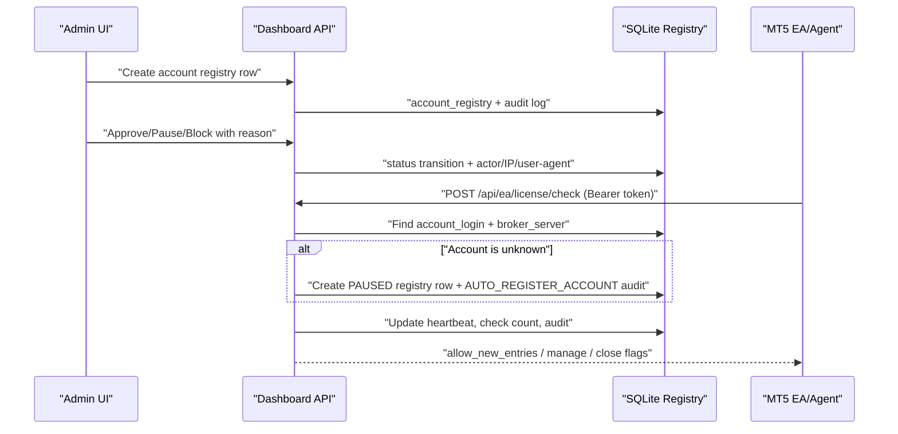

# Account Approval and Suspension License Gate

## Requirements

The web dashboard is now the source of truth for MT5 account approval. This phase is a license/account gate only.

- No trade execution from the web.
- No MT5 trade password or investor password storage.
- No hardcoded token or secret in the repository.
- Production EA files stay untouched. EA integration must be tested in a lab/prototype first.
- Admin can register MT5 accounts, approve, pause, or block them, and inspect audit history.
- EA/Agent can call `POST /api/ea/license/check` before opening new entries.
- A valid EA/Agent token can auto-register an unknown `account_login + broker_server` pair as `PAUSED`; admin approval is still required before new entries are allowed.

## Status Model

| Status | New entries | Manage existing | Close existing | Intended use |
|---|---:|---:|---:|---|
| `APPROVED` | yes | yes | yes | Normal trading |
| `PAUSED` | no | yes | yes | Temporary stop for news, manual review, or planned pause |
| `BLOCKED` | no | yes | yes | Unauthorized, suspended, expired, mismatched, or unregistered account |

Legacy rows are migrated as follows:

- `APPROVED` -> `APPROVED`
- `PAUSED_NEW_ENTRIES`, `REVIEW` -> `PAUSED`
- `SUSPENDED`, `EXPIRED`, `LIQUIDATE_ONLY` -> `BLOCKED`

## Architecture



## Database Schema

`init_db()` creates these tables:

- `account_registry`: MT5 account approval record and last EA heartbeat.
- `account_audit_log`: immutable audit events for status changes, imports, updates, and license checks.
- `ea_agent_tokens`: hashed per-agent bearer tokens. The default token can be seeded from `EA_LICENSE_API_TOKEN`.

Important columns:

- `account_login`, `broker_name`, `broker_server`, `account_type`, `symbol`
- `ib_group`, `referral_tag`, `owner_name`, `note`
- `allowed_eas`, `allowed_version`, `allowed_build_hash`, `allowed_preset`, `risk_profile`
- `status`, `reason`, `approved_by`, `approved_at`, `suspended_by`, `suspended_at`, `expiry_date`
- `last_license_check_at`, `last_ea_heartbeat_at`, `last_ea_name`, `last_ea_version`, `last_symbol`, `last_machine_id_hash`
- `license_check_count`, `license_reject_count`

## Admin API

- `GET /api/admin/accounts`
- `POST /api/admin/accounts`
- `PUT /api/admin/accounts/{account_id}`
- `DELETE /api/admin/accounts/{account_id}`
- `POST /api/admin/accounts/{account_id}/status`
- `GET /api/admin/accounts/{account_id}/audit`
- `GET /api/admin/audit-log`
- `POST /api/admin/accounts/import-csv`

All admin endpoints require the existing admin session cookie.
Deleting a registry account removes it from License Gate approval only; it does not delete MT5 portfolio history or trade data.
The admin create form supports preset EA chips plus a free-text custom EA name for new packages.

## EA License Check API

`POST /api/ea/license/check`

Headers:

```http
Authorization: Bearer <per-agent-token>
```

Request:

```json
{
  "account_login": "97075178",
  "broker_server": "InterStellarFinancial-Server",
  "symbol": "XAUUSD.c",
  "ea_name": "SteadyFlow",
  "ea_version": "V1.4 X10 TH",
  "magic": 56789,
  "build_hash": "...",
  "machine_id": "...",
  "timestamp": "..."
}
```

Approved response:

```json
{
  "status": "APPROVED",
  "allow_new_entries": true,
  "allow_manage_existing": true,
  "allow_close_existing": true,
  "message": "approved",
  "check_interval_seconds": 60
}
```

Paused response:

```json
{
  "status": "PAUSED",
  "allow_new_entries": false,
  "allow_manage_existing": true,
  "allow_close_existing": true,
  "message": "account paused by admin: reason...",
  "check_interval_seconds": 30
}
```

Blocked response:

```json
{
  "status": "BLOCKED",
  "allow_new_entries": false,
  "allow_manage_existing": true,
  "allow_close_existing": true,
  "message": "account blocked by admin: reason...",
  "check_interval_seconds": 30
}
```

First check from an unknown account:

```json
{
  "status": "PAUSED",
  "allow_new_entries": false,
  "allow_manage_existing": true,
  "allow_close_existing": true,
  "message": "account paused by admin: auto-registered; pending admin approval",
  "check_interval_seconds": 30
}
```

The request also creates an `account_registry` row with `status=PAUSED`, heartbeat fields, hashed `machine_id`, detected EA/version/symbol metadata, and an `AUTO_REGISTER_ACCOUNT` audit event. Admin must still approve it.

## Security Checklist

- Tokens are accepted via `Authorization: Bearer` or `X-EA-Token`.
- Tokens are hashed with SHA-256 before storage/lookup.
- No token value is returned to UI or written to audit metadata.
- Basic per-IP/token rate limiting is applied to license checks.
- Status transitions require an admin session and a reason.
- Audit rows include actor, role, IP, user agent, old status, new status, reason, and metadata.
- Demo users cannot see registry, audit, Reporter, System Health, or admin actions.
- HMAC request signing is documented as a later hardening step if replay protection is required beyond bearer tokens.

## Production E2E Check

Run this after deploying the license gate or changing Account Registry behavior:

```powershell
$env:QA_ADMIN_PASSWORD="<admin password>"
$env:EA_LICENSE_API_TOKEN="<agent token>"
npm run qa:license-gate-production
```

The script uses a synthetic QA account (`999000001` on `QA-License-Server`) so it does not alter live portfolio accounts. It verifies:

- missing and invalid tokens are rejected
- unregistered accounts auto-register as `PAUSED`
- `APPROVED`, `PAUSED`, `BLOCKED`, and expiry-derived `BLOCKED` decisions
- status changes and license checks are present in account audit history
- the QA account is reset to `PAUSED` at the end

## CSV Import Guide

Required columns:

```csv
account_login,broker_server
```

Optional columns:

```csv
broker_name,status,allowed_eas,symbol,account_type,ib_group,referral_tag,owner_name,note,allowed_version,allowed_build_hash,allowed_preset,risk_profile,expiry_date,reason
```

`allowed_eas` may be a comma list or JSON list.

## EA Behavior Design

- `OnInit`: call license check once. If unavailable, start in paused-new-entries mode unless a valid last-known approval exists.
- `OnTimer`: repeat every `check_interval_seconds`.
- `APPROVED`: normal trading.
- `PAUSED`: block new entries, keep existing basket management and close paths.
- `BLOCKED`: block new entries, keep existing basket management and close paths.
- API outage: allow last-known-approved only until TTL, for example 10-30 minutes. After TTL, pause new entries.
- Never spam orders when AutoTrading is disabled or license blocks new entries.

## Current Implementation State

Implemented:

- Additive SQLite migration/schema.
- Auto-registration of unknown EA accounts as `PAUSED` pending admin approval.
- Admin Account Registry UI.
- Admin Audit Log UI.
- License check API with bearer token, rate limit, status decisions, heartbeat fields, and audit events.
- Dashboard account enrichment with `approval_status`.
- CSV import report.
- Lab MQL5 module documentation/prototype.

Not live yet:

- Production EA integration.
- HMAC signature verification.
- Dedicated token creation UI.
- Direct trading controls from web. This is intentionally excluded.
