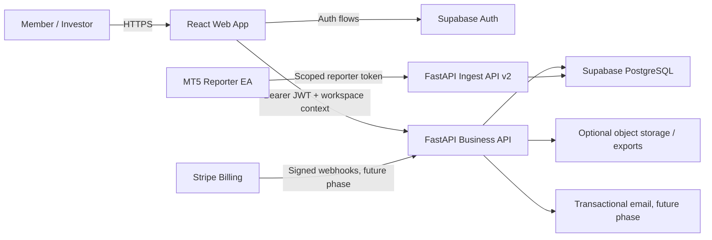

# The Entity Membership and Multi-Tenant Architecture

Status: Architecture proposal only. Do not implement or deploy from this document without a separate approved implementation plan.

Date: 2026-06-04

## 1. Objective

Evolve The Entity from a private single-portfolio dashboard into a membership platform similar in business capability to FinTraderPro, while preserving the current monitoring dashboard and MT5 WebRequest reporter.

The future platform should support:

- Public or invite-only user registration.
- Multiple independent customers without data leakage.
- Multiple portfolios and MT5 accounts per customer.
- Owner, administrator, viewer, and investor access.
- Configurable investor privacy.
- Per-customer MT5 reporter credentials.
- Plan limits and recurring subscriptions when billing is enabled.
- A safe migration path for the current owner account and existing MT5 data.

Billing and public registration are intentionally deferred. The first implementation phase should establish secure multi-tenancy without changing the current customer-facing product.

## 2. Current-State Constraints

The current application is a single-tenant system:

- `AUTH_USERS` defines only the hard-coded `admin` and `demo` users.
- A custom signed cookie stores `username` and `role`.
- One shared `INGEST_API_KEY` authorizes every MT5 reporter.
- SQLite stores all accounts globally.
- `accounts.account_number` and `open_trades.ticket` are globally unique.
- `/api/dashboard` loads every account and only sanitizes the response for the demo role.
- Demo privacy is controlled by global environment flags rather than per investor or workspace.
- The React frontend assumes one current portfolio and has no workspace context.

These constraints make adding only a Register button unsafe. True membership requires tenant ownership in authentication, ingestion, storage, API queries, and UI state.

## 3. Architecture Options

### Option A: Supabase Auth + PostgreSQL + Existing FastAPI

Recommended.

- Supabase Auth handles signup, email verification, login, password reset, and sessions.
- Supabase PostgreSQL becomes the source of truth.
- Existing FastAPI remains the business API, dashboard aggregator, admin API, and MT5 ingest API.
- The React frontend sends the Supabase access token to FastAPI.
- FastAPI validates identity and workspace membership before every business query.
- MT5 reporters use separate scoped reporter tokens, not user sessions.

Advantages:

- Removes custom password/session handling.
- PostgreSQL supports proper multi-tenant constraints, indexes, retention, and future billing data.
- Row Level Security provides defense in depth.
- Preserves the current FastAPI and React investment.

Trade-offs:

- Requires a controlled SQLite-to-PostgreSQL migration.
- Adds Supabase as a managed dependency.
- Authorization logic must be designed carefully across FastAPI and RLS.

### Option B: Self-Hosted PostgreSQL + FastAPI Authentication

- Run PostgreSQL on Oracle Cloud.
- Build password hashing, verification, reset email, session revocation, and account security in FastAPI.

Advantages:

- Full infrastructure control.
- No Supabase platform dependency.

Trade-offs:

- Highest security and maintenance burden.
- More work before basic membership is trustworthy.
- Email verification and account recovery become additional subsystems.

### Option C: Managed Auth Provider + PostgreSQL

- Use Clerk, Auth0, or another managed identity provider.
- Keep PostgreSQL and FastAPI for business data.

Advantages:

- Strong hosted authentication and polished auth UI.

Trade-offs:

- Another vendor and pricing model.
- Authorization and tenant membership still need custom design.

### Decision

Use Option A when implementation begins. Keep telemetry and business queries behind FastAPI, use Supabase Auth for identity, and use PostgreSQL/RLS as defense in depth.

## 4. Target System Context



Important boundaries:

- Browser clients never receive a Supabase service-role key.
- MT5 reporters never use a user login or Supabase JWT.
- Reporter tokens determine tenant ownership server-side. The payload cannot choose another workspace.
- Business data should be queried through FastAPI first. Direct Data API access is optional and should remain restricted.

## 5. Tenant Model

The tenant boundary is a `workspace`.

```text
User
  -> Workspace Membership
      -> Workspace
          -> Portfolios
              -> MT5 Accounts
                  -> Open Trades
                  -> Daily History
                  -> Equity Snapshots
          -> Reporter Tokens
          -> Investor Privacy Profiles
          -> Subscription and Entitlements
```

### Why Workspace Is the Tenant

- One customer may operate multiple portfolios.
- One workspace may have multiple staff members or investors.
- Subscription limits apply to the workspace, not an individual login.
- A user can be invited to more than one workspace later.

## 6. Proposed Data Model

Use UUID primary keys for internal relations. Keep broker account numbers and tickets as external identifiers only.

### Identity and Membership

#### `profiles`

- `user_id uuid primary key` referencing Supabase `auth.users`
- `display_name text`
- `timezone text`
- `created_at timestamptz`
- `updated_at timestamptz`

#### `workspaces`

- `id uuid primary key`
- `name text`
- `slug text unique`
- `owner_user_id uuid`
- `status text`: `active`, `suspended`, `closed`
- `created_at timestamptz`
- `updated_at timestamptz`

#### `workspace_members`

- `workspace_id uuid`
- `user_id uuid`
- `role text`: `owner`, `admin`, `viewer`, `investor`
- `privacy_profile_id uuid null`
- `status text`: `invited`, `active`, `revoked`
- `created_at timestamptz`
- Unique: `(workspace_id, user_id)`

#### `workspace_invitations`

- `id uuid primary key`
- `workspace_id uuid`
- `email text`
- `role text`
- `privacy_profile_id uuid null`
- `token_hash text`
- `expires_at timestamptz`
- `accepted_at timestamptz null`

### Portfolio and MT5 Telemetry

#### `portfolios`

- `id uuid primary key`
- `workspace_id uuid`
- `name text`
- `base_currency text`
- `status text`
- `created_at timestamptz`

#### `mt5_accounts`

- `id uuid primary key`
- `workspace_id uuid`
- `portfolio_id uuid`
- `account_number text`
- `broker_name text`
- `broker_server text`
- `environment text`: `demo`, `live`
- `display_name text`
- `strategy_name text null`
- `risk_profile text null`
- Current balance, equity, margin, free margin, drawdown, peak drawdown, closed P&L/trades/lots
- `last_reporter_update_at timestamptz`
- `status text`: `live`, `stale`, `offline`, `disabled`
- Unique: `(workspace_id, broker_server, account_number)`

Do not use `account_number` as the primary key. The same number can exist at different brokers or servers.

#### `open_trades`

- `id uuid primary key`
- `workspace_id uuid`
- `mt5_account_id uuid`
- `external_ticket text`
- Symbol, direction, lots, prices, P&L, timestamps
- Unique: `(mt5_account_id, external_ticket)`

#### `daily_history`

- `id uuid primary key`
- `workspace_id uuid`
- `mt5_account_id uuid`
- `trading_date date`
- Daily P&L, closed deals, closed lots
- Unique: `(mt5_account_id, trading_date)`

#### `equity_snapshots`

- `id bigint generated always as identity`
- `workspace_id uuid`
- `mt5_account_id uuid`
- `bucket_ts timestamptz`
- Balance, equity, floating, drawdown, open positions
- Unique: `(mt5_account_id, bucket_ts)`

Partitioning or retention policies can be added later if snapshot volume grows.

### Reporter Authentication

#### `reporter_tokens`

- `id uuid primary key`
- `workspace_id uuid`
- `portfolio_id uuid null`
- `name text`
- `token_prefix text`
- `token_hash text`
- `last_four text`
- `status text`: `active`, `revoked`
- `last_used_at timestamptz null`
- `expires_at timestamptz null`
- `created_by uuid`
- `created_at timestamptz`

Only the token hash is stored. The complete token is shown once when created.

### Privacy and Sharing

#### `privacy_profiles`

- `id uuid primary key`
- `workspace_id uuid`
- `name text`
- Boolean visibility controls:
  - `show_account_ids`
  - `show_brokers`
  - `show_lots`
  - `show_pnl`
  - `show_tickets`
  - `show_open_prices`
  - `show_system_health`
  - `allow_exports`
- `created_at timestamptz`

This replaces the current global `DEMO_PRIVACY` flags with configurable per-member visibility.

### Plans and Billing

#### `plans`

- `id text primary key`: `free`, `standard`, `pro`
- Display name and feature description
- Maximum MT5 accounts, portfolios, members, history days, and reporter tokens
- Feature flags for exports, alerts, investor sharing, and advanced analytics

#### `workspace_subscriptions`

- `workspace_id uuid primary key`
- `plan_id text`
- `provider_customer_id text null`
- `provider_subscription_id text null`
- `status text`
- `current_period_end timestamptz null`
- `cancel_at_period_end boolean`

#### `audit_events`

- `id bigint generated always as identity`
- `workspace_id uuid null`
- `actor_user_id uuid null`
- `event_type text`
- `target_type text`
- `target_id text`
- `metadata jsonb`
- `created_at timestamptz`

## 7. Roles and Permissions

| Capability | Platform Admin | Workspace Owner | Workspace Admin | Viewer | Investor |
|---|---:|---:|---:|---:|---:|
| Access all workspaces | Yes | No | No | No | No |
| Manage workspace and billing | Yes | Yes | No | No | No |
| Invite/revoke members | Yes | Yes | Yes | No | No |
| Create/revoke reporter tokens | Yes | Yes | Yes | No | No |
| Rename/configure MT5 accounts | Yes | Yes | Yes | No | No |
| View operational diagnostics | Yes | Yes | Yes | Optional | No |
| View portfolio data | Yes | Yes | Yes | Yes | Privacy profile |
| Export data | Yes | Yes | Yes | Configurable | Privacy profile |

`platform_admin` must not be stored as an editable user metadata field. It should be an internal authorization record controlled only by the server.

## 8. Authentication and User Flows

### Registration

1. User registers with email and password.
2. User verifies email.
3. System creates a profile, workspace, owner membership, default portfolio, and default privacy profile.
4. User enters onboarding and generates the first reporter token.

### Login and Recovery

- Supabase Auth handles login, refresh tokens, logout, email verification, and password reset.
- FastAPI validates the bearer JWT and resolves active workspace membership.
- Sensitive actions such as revealing or rotating reporter tokens should require recent authentication.

### Invitations

1. Owner/admin invites an email with a role and optional privacy profile.
2. Invitation stores only a hashed acceptance token and expiration.
3. User signs in or registers, then accepts the invitation.
4. Membership becomes active and the event is audited.

### Existing Demo Experience

The public demo should remain separate from customer membership:

- Use a dedicated read-only demo workspace with synthetic or approved data.
- Do not grant public demo users access to any production workspace.
- Keep account IDs, tickets, prices, and system diagnostics hidden.

## 9. API Design

Introduce versioned APIs rather than changing the current endpoints in place.

### Browser Business API

- `GET /api/v2/me`
- `GET /api/v2/workspaces`
- `POST /api/v2/workspaces`
- `GET /api/v2/workspaces/{workspace_id}/dashboard`
- `GET /api/v2/workspaces/{workspace_id}/portfolios`
- `POST /api/v2/workspaces/{workspace_id}/members/invite`
- `GET /api/v2/workspaces/{workspace_id}/reporter-tokens`
- `POST /api/v2/workspaces/{workspace_id}/reporter-tokens`
- `POST /api/v2/workspaces/{workspace_id}/reporter-tokens/{token_id}/revoke`
- `PATCH /api/v2/accounts/{account_id}`

Every request must validate:

1. Authenticated user identity.
2. Active workspace membership.
3. Required role/capability.
4. Workspace ownership of the requested resource.

### MT5 Ingest API

- `POST /api/v2/ingest/mt5`
- Header: `Authorization: Reporter <token>`

Ingest flow:

1. Hash the supplied reporter token.
2. Resolve its active workspace and optional portfolio scope.
3. Validate plan account limits.
4. Resolve or create the MT5 account within that workspace.
5. Upsert telemetry using internal `mt5_account_id`.
6. Update token and account freshness timestamps.
7. Write an audit event only for exceptional actions, not every heartbeat.

The payload must never be allowed to set `workspace_id`.

### Billing Webhooks, Future Phase

- `POST /api/v2/webhooks/stripe`
- Verify the Stripe signature.
- Make handlers idempotent.
- Store subscription state locally.
- Enforce entitlements server-side, never from frontend plan labels.

## 10. PostgreSQL and RLS Strategy

- Put sensitive telemetry tables in a private schema where practical.
- Enable RLS on every table exposed through the Supabase Data API.
- Authorization should use `workspace_members`, not user-editable metadata.
- Do not use `raw_user_meta_data` for roles or workspace authorization.
- Use security-invoker views if views are exposed.
- Keep Supabase service-role credentials only in FastAPI/server secrets.
- Add compound indexes beginning with `workspace_id` for tenant-scoped queries.

Example policy intent:

```text
Authenticated user can select a workspace row
only when an active workspace_members row exists
for auth.uid() and that workspace.
```

FastAPI remains responsible for applying privacy profiles before returning investor-facing payloads.

## 11. Subscription and Entitlement Model

Initial plan proposal, subject to later pricing decisions:

| Entitlement | Free | Standard | Pro |
|---|---:|---:|---:|
| MT5 accounts | 1 | 5 | 20 |
| Portfolios | 1 | 3 | 10 |
| Members | 1 | 3 | 15 |
| History retention | 30 days | 1 year | Extended |
| Exports | No | Yes | Yes |
| Investor sharing | No | Limited | Yes |
| Alerts | Basic | Yes | Advanced |

Plan limits are enforced in FastAPI. UI labels are informational only.

Use Stripe Billing with Checkout Sessions when billing is implemented. Do not build a custom card form for the first billing version.

## 12. Required Product Surfaces

### Public

- Landing page.
- Pricing page.
- Login, registration, email verification, and password reset.
- Terms of service and privacy policy.

### Member Application

- Workspace/portfolio selector.
- Existing Overview, Expert Advisors, Symbols, Active Trades, MT5 Preview, and History.
- Members and invitations.
- Reporter connections and token rotation.
- Privacy profiles / investor access.
- Plan usage and billing.
- Account/profile settings.

### Platform Administration

- Workspace lookup and suspension.
- Subscription/support status.
- Audit events.
- No direct password visibility.

## 13. Migration Strategy

### Phase 0: Preparation

- Purchase/configure a domain and HTTPS before public authentication.
- Create PostgreSQL staging environment.
- Create tested backup and restore procedures.
- Record current row counts, totals, and latest timestamps.

### Phase 1: Internal Multi-Tenancy

- Create one owner workspace and one separate demo workspace.
- Add tenant-aware PostgreSQL schema.
- Import existing SQLite accounts, trades, history, and snapshots into the owner workspace.
- Keep the current UI and current admin/demo login temporarily.
- Introduce `/api/v2/ingest/mt5` and per-workspace reporter tokens.
- Keep the legacy ingest endpoint temporarily mapped only to the owner workspace.

### Phase 2: Membership Authentication

- Enable Supabase Auth.
- Add workspace membership resolution to FastAPI.
- Migrate the current owner to a workspace-owner account.
- Preserve the public demo as a read-only demo workspace.

### Phase 3: Member Management and Privacy

- Add invitations, viewer/investor roles, privacy profiles, and token management UI.
- Add audit events for sensitive changes.

### Phase 4: Plans and Billing

- Add plan entitlements.
- Integrate Stripe Checkout and webhooks.
- Start with manual plan assignment before enabling paid self-service.

### Phase 5: Public Launch

- Enable public registration.
- Add legal pages, email delivery, rate limits, support flow, monitoring, backups, and incident procedures.

## 14. Migration Validation

Before switching production:

- Account counts match by workspace.
- Open trade counts and total lots match.
- Sum of balance, equity, floating P&L, and closed P&L match.
- Daily-history date ranges match.
- Latest reporter update timestamps match.
- Existing reporter payloads are accepted by a compatibility endpoint.
- Admin sees owner workspace data only.
- Demo/investor cannot access owner workspace data or diagnostics.
- Revoked reporter tokens fail immediately.
- Cross-workspace API and direct database access tests fail.

## 15. Security Requirements

- Domain and HTTPS are required before public membership.
- Do not retain the current plain environment-password model for public users.
- Do not expose the Supabase service-role key to the browser.
- Store reporter tokens and invitation tokens as hashes.
- Rate-limit auth-sensitive and ingest endpoints.
- Log token creation, revocation, role changes, invitations, exports, and billing changes.
- Require confirmation or recent authentication for destructive or sensitive actions.
- Back up PostgreSQL and test restoration regularly.
- Define retention rules for high-volume equity snapshots.
- Run automated admin/viewer/investor permission tests before every deploy.

## 16. Main Risks and Mitigations

### Cross-Tenant Data Leakage

Risk: A missing `workspace_id` filter exposes another customer's accounts.

Mitigation: Tenant-aware repository methods, FastAPI authorization checks, RLS defense in depth, and negative cross-tenant tests.

### Reporter Token Leakage

Risk: A leaked token can submit incorrect telemetry.

Mitigation: Store hashes, support immediate revocation/rotation, scope tokens, rate-limit ingestion, and audit anomalies.

### Migration Data Drift

Risk: SQLite and PostgreSQL differ during migration.

Mitigation: Short read-only cutover or controlled compatibility period, reconciliation reports, and rollback backup.

### Subscription State Drift

Risk: Billing provider state and local entitlements disagree.

Mitigation: Signed idempotent webhooks and periodic reconciliation.

### Snapshot Growth

Risk: Equity snapshots grow rapidly with many accounts.

Mitigation: Retention limits by plan, aggregation jobs, indexes, and later partitioning.

## 17. Explicitly Deferred

Do not include these in the first membership implementation:

- Copy trading or trade execution from the website.
- EA licensing/DRM.
- Marketplace for selling EAs.
- White-label themes.
- AI trading recommendations.
- Direct MT5 DLL/MySQL integration.
- Fully automated paid subscription launch.

## 18. Definition of Done for the First Future Implementation

The first membership implementation is complete only when:

- Current production data is assigned to an owner workspace.
- A separate demo workspace exists.
- Users authenticate through managed auth.
- Every dashboard and account query is tenant-scoped.
- Each reporter uses a revocable tenant-scoped token.
- Owner/admin/viewer/investor permissions pass automated tests.
- Investor privacy settings are applied server-side.
- Existing dashboard functionality remains available.
- Rollback and data reconciliation procedures are documented and tested.

## 19. Recommended Next Action When Work Resumes

Create a separate implementation plan for Phase 1 only: internal multi-tenancy and PostgreSQL migration without public registration or billing. Do not begin with the registration UI; the tenant-safe data model and ingest path must exist first.
